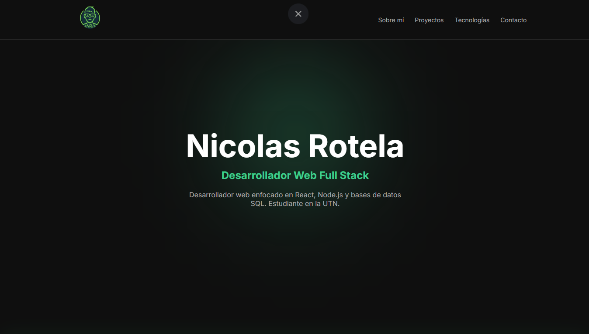
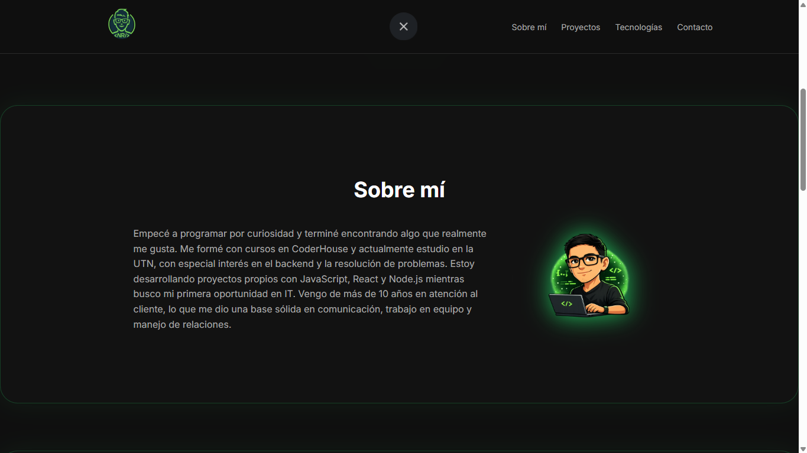
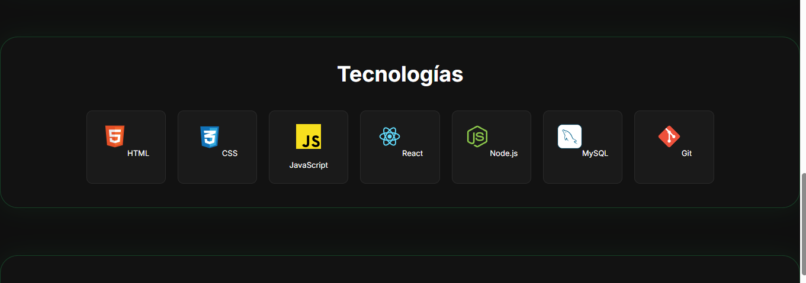

# Portfolio - Nicolas Rotela

Portfolio enfocado en mostrar proyectos reales y habilidades en desarrollo web full stack.

---

## Descripción

Este portfolio presenta mis proyectos principales, incluyendo aplicaciones full stack con lógica de negocio, manejo de datos y frontend interactivo.

Fue desarrollado como parte de mi proceso de formación construyendo proyectos reales.

---

## Tecnologías

- React
- JavaScript
- CSS

---

## Demo

https://portfolio-nicolas-rotela-4fyr.vercel.app/#hero

### Vista principal


### Sobre mi


### Tecnologias


## Proyecto destacado

### Mr. Chispa POS

Sistema de ventas (POS) con gestión de productos, carrito de ventas y control de stock.

Proyecto full stack desarrollado con React, Node.js y MySQL.

https://github.com/nico-rotela/Mr-Chipa-Pos

---

## Instalación

1. Clonar el repositorio

```bash
git clone https://github.com/nico-rotela/portfolio-nicolas-rotela
